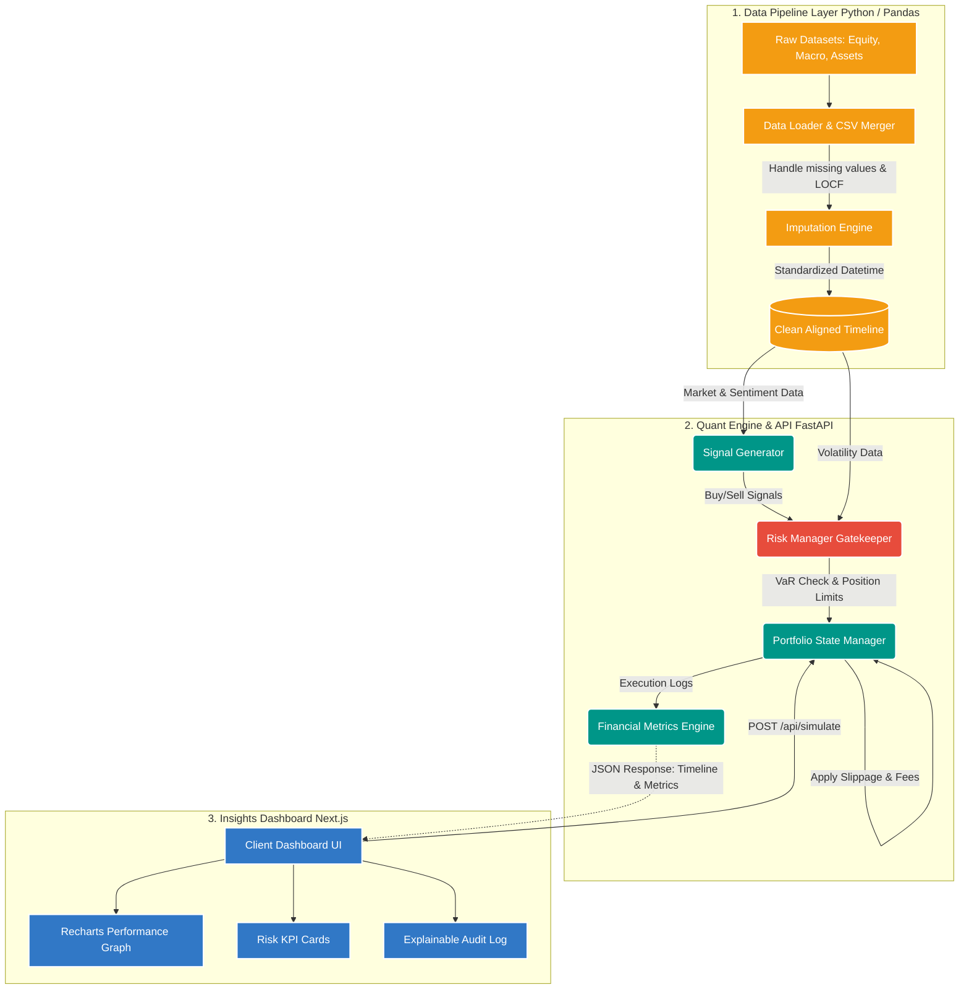

# Hedge Fund Risk Modeling & Semi-Automated Trading System

## Team Information
- **Team Name**: Kabhi Code Kabhi Bug
- **Year**: 3rd Year
- **All-Female Team**: No

## Overview
This project separates heavy financial computation from the user interface to create a modular trading system.

The architecture is divided into three layers:
- **Data Pipeline** for ingesting and aligning raw time series data
- **Quant Engine (Backend)** for signal generation, risk management, and trade simulation
- **Insights Dashboard (Frontend)** for visualization and explainability

## Architecture Overview

This system is a comprehensive quantitative finance platform designed to bridge the gap between algorithmic signal generation and institutional-grade risk management.

It operates through a decoupled three-layer architecture to ensure scalability, low-latency execution, and high data integrity.

### 1. Data Pipeline Layer (Python & Pandas)

The ingestion engine processes heterogeneous datasets including:
- Equity OHLC data
- Macroeconomic indicators
- Multi-asset datasets
- Sentiment-driven signals

The preprocessing layer:
- Handles missing values
- Aligns asynchronous datasets
- Standardizes timestamps
- Applies Last Observation Carried Forward (LOCF)

This produces a clean aligned timeline for reliable backtesting and eliminates look-ahead bias.

### 2. Quant Engine & API (FastAPI)

The backend acts as the core decision-making engine.

Key responsibilities include:
- Signal generation using technical indicators
- Risk filtering using Value at Risk (VaR)
- Position sizing and portfolio constraints
- Slippage and transaction cost simulation
- Execution logging and performance tracking

Every trade passes through a risk gatekeeper before execution.

### 3. Insights Dashboard (Next.js & Recharts)

The frontend provides:
- Interactive portfolio analytics
- Real-time KPI monitoring
- Explainable trade audit logs
- Equity curve visualization
- Risk-adjusted performance metrics

The dashboard is designed to help users understand not just *what* happened, but *why* it happened.

### System Architecture Diagram



## Architectural Flow & Explanation

### 1. Data Ingestion & Preprocessing (The Foundation)

To prevent forward-looking bias, the system ingests multiple asynchronous datasets using Pandas.

The preprocessing layer:
- Cleans missing values
- Aligns macroeconomic and stock datasets
- Synchronizes timestamps
- Applies LOCF-based imputation

The output is a single consistent timeline used throughout the simulation engine.

### 2. The Quant Engine & Risk Gatekeeper (Backend)

Built on FastAPI, this layer serves as the mathematical core of the platform.

#### Signal Generation
The engine generates Buy/Sell signals using:
- Moving average crossovers
- Volatility filters
- Sentiment-based indicators

#### Risk Management
Before execution:
- Parametric VaR is calculated
- Portfolio exposure is checked
- Position limits are enforced
- Trades exceeding risk thresholds are resized or rejected

#### Realistic Trade Execution
Approved trades are passed into the portfolio engine where:
- Transaction fees are deducted
- Slippage is simulated
- Cash balance and holdings are updated

This ensures realistic and institution-style backtesting.

### 3. Insights Dashboard & Metrics (Frontend)

The frontend dashboard consumes backend APIs and visualizes:
- Portfolio equity curve
- Drawdown analysis
- Sharpe Ratio
- Alpha/Beta metrics
- Risk-adjusted performance

An explainability log displays:
- Trade decisions
- Risk rejections
- Slippage costs
- Portfolio actions

This makes the system transparent rather than a black-box trading engine.

### File Structure

```text
hedge-fund-system/
├── data/
│   ├── equity_dataset.csv
│   ├── macro-dataet.csv
│   ├── multi_assetdataset.csv
│   └── oil_dataset.csv
│
├── backend/
│   ├── main.py
│   ├── requirements.txt
│   ├── data_pipeline/
│   │   ├── __init__.py
│   │   ├── loader.py
│   │   └── preprocessor.py
│   │
│   ├── engine/
│   │   ├── __init__.py
│   │   ├── portfolio.py
│   │   ├── risk_manager.py
│   │   └── signal_generator.py
│   │
│   └── api/
│       ├── __init__.py
│       ├── routes.py
│       └── metrics.py
│
├── frontend/
│   ├── package.json
│   ├── tailwind.config.js
│   ├── src/
│   │   ├── app/
│   │   │   ├── page.tsx
│   │   │   ├── layout.tsx
│   │   │   └── globals.css
│   │   │
│   │   ├── components/
│   │   │   ├── KPICards.tsx
│   │   │   ├── PerformanceChart.tsx
│   │   │   ├── TradeLogTable.tsx
│   │   │   └── SimulationControls.tsx
│   │   │
│   │   └── lib/
│   │       └── api.ts
```

#### Describe your approach here. Keep it short and clear.

- The system ingests equity, macroeconomic, and sentiment datasets through a unified preprocessing pipeline built with Pandas.
- Risk modeling is based on Parametric Value at Risk (VaR), volatility filtering, and portfolio exposure constraints integrated directly into the execution pipeline.
- Trading signals are generated using technical indicators and filtered through risk management layers before execution with slippage and fee simulation.
- The dashboard provides explainable analytics including Sharpe Ratio, drawdown, trade logs, and performance visualization for transparent decision-making.

**Note:** Please do not change the format or spelling of anything in this README. The fields are extracted using a script, so any changes to the structure or formatting may break the extraction process.